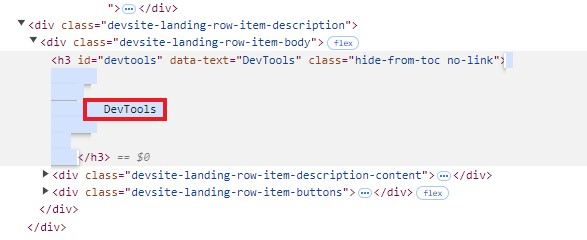

---

ShowReadingTime: true
ShowBreadCrumbs: true
summary: 
tags:
categories:
draft: true
---
As a lone technical writer, I tend to wear many content hats. This quarter, I was tasked with a big project: writing the UX copy for a new data product that our delivery team is developing. While it's not unheard of for tech writers to be asked to do UX writing, I knew enough about the field to know there was a lot I didn't know. 

Up to this point in my career, I had written some tooltips and given feedback on wireframes from a user's perspective. But now I had the opportunity to work on all the microcopy in a software product---end-to-end, not just on one or two screens.

## A note on terminology
Right away, I noticed folks struggling with how to communicate about UX writing. People even struggled with what to call the content itself.

Is it...
- UX writing?
- UI text?
- Product copy?
- Microcopy?

While it doesn't make a huge difference what you call it (I prefer UX writing), I found that it goes a long way to use terms consistently. This builds credibility and establishes that you're thoughtful and knowledgeable about your profession.

## Lesson #1: Read about UX writing
This is the simplest lesson---there are many knowledgeable folks who have documented the answers you're looking for!

When I started planning my project, I ordered two UX writing books:


There are many good books out there, but I found both of these approachable and helpful. I read through both in a couple afternoons. 

**[Microcopy: The Complete Guide by Kinneret Yifrah](https://www.microcopybook.com/)**:
The first book, *Microcopy*, is a great reference. It's heavier on the marketing side of UX writing, focusing on e-commerce apps and products with customers (rather than *end users*). But it did include a section on "technical products" that grounded a lot of the advice for the data-heavy products I work on. It has good info on writing empty states, error messages, and contact us forms, as well as a discussion on when to use static vs dynamic content. 

**[Strategic Writing for UX by Torrey Podmajersky](https://www.oreilly.com/library/view/strategic-writing-for/9781492049388/)**:
If you only read one book, I think it should be this one. While reading, I kept wanting to give every front-end developer I've ever worked with a copy, since it discusses user behavior in such a practical way. *Strategic Writing* goes into detail on how to collaborate with designers and how to manage content reviews, which I always find useful to read about. It also dives deep into developing voice charts, enforcing a product tone, and establishing a consistent brand through UX writing. It contains a lot of info on UX patterns which I found extremely helpful. 

## Lesson #2: Learn the basic UX text patterns
Learn UX text patterns (and what they're called) and use them when you collaborate with teammates.

While there's a lot more to UX writing than just learning text patterns, knowing and using these patterns gave me what I needed to make a big impact. It gave me the toolkit to examine why something wasn't working as well as it could, then propose a solution based on industry standards. In addition to building credibility, knowing what the standards are and what to call them will streamline the review process.

I aggregated the most common UX patterns I found and created a reference list. This isn't comprehensive by any means, but it's easy to reference while I'm working.

> ### UX text patterns
> *Most of this information is adapted from Strategic UX Writing by Torrey Podmajersky.*
> - **Titles**
>   - Can be a ...
>       - Brand name
>       - Content name
>       - Ambiguous task
>       - Single task
> - **Descriptions**
>   - Keeps users moving forward and establishes what to expect
>   - Often paired with a title
>   - Usually full sentences
>   - Users should develop understanding of text within 50 characters (3-6 words)
>   - Keep paragraphs to max 3 lines
> - **Buttons and other interactive text**
>   - Can match a title that directs action
>   - Keep to 1-2 words
>   - Recognizable and specific
>   - Verb-first
> - **Empty states**
>   - Instructs the user on what to do
>   - "To do X, do Y"
> - **Labels**
>   - Noun phrases and adjectives that describe things
> - **Controls**
>   - Informs users of extent and state of possible customizations
>   - Usually the name and state
> - **Text input fields**
>   - Helps users enact accurate info
>   - Options:
>        - Name of info to be entered
>        - Example of info to be entered
>        - Verb-first instructions on entering info
>        - Guidance for how user can be successful
> - **Transitional text**
>   - Confirms that an action is happening
>   - Can use ellipses: "is uploading..." "are sending..."
> - **Confirmation messages**
>   -  Reassures users the progress/results they expect are complete
> - **Notifications**
>   - Informs or reminds a user to engage
>   - Lock screen, notification center, or banner
>   - Usually two pieces of text: title and description
>   - Reserve for positive experiences
> - **Error messages**
>   - Helps users get where they want to go; indicates there's a problem
>   - Verb-first brief instructions
>   - Inline error, detour error, blocking error
> - **Links to the documentation**
>   - When it's too complex for a description or tooltip
>   - Link to the exact place in the article when you can

I keep this list open next to me while I work, so I kept each item brief to quickly remind me what each pattern is and the value they're supposed to bring to the user.


## Lesson #3: Work directly in the product to visualize content changes
When I propose a content change, I make the change directly in the wireframe or the product itself so everyone can visualize the change (if it's a browser-based app, I share an easy way to do this below). This helps me understand how content will affect the design so I'm prepared to discuss that with the designer. It also helps me communicate exactly what I have in mind, which is helpful when I'm adding elements like tooltips or a button that I wrote a label for. 

### Working in wireframes
Whatever tool the designer uses---Figma, Miro, Sketch, Balsamiq, Adobe XD---I make a copy of their wireframe and create a new file so I can make changes directly to the text elements without changing their work directly. When I need to add an element like a tooltip, I add text in a different color with a callout. 

Here's an artificial wireframe I created to show how I might propose a change:


Depending on the collaboration style of the designer you're working with, it may be better to add comments directly on the wireframe instead:


This style works well for teams who tend to work asynchronously. It's especially important to know how to communicate your changes when you're limited to communicating via a comment. 

### Working in a browser-based app
One of my projects involved reviewing a product where all the designs had already been deployed to a test environment. To quickly visualize changes, I like to use built-in browser tools to change the content. I've been doing this forever and it's not difficult once you get the hang of it.

I use Google Chrome so I'll demonstrate the [Chrome DevTools](https://developer.chrome.com/docs/devtools/). Other browsers generally have similar tools.

As an example, I'll change some text on the DevTools homepage:


**To edit a text element in Chrome:**

**Step 1:** Right-click the text element you want to change, then click **Inspect**. 

In this example, I want to inspect the *DevTools* title.


Chrome will open the DevTools **Elements** panel, which displays the HTML for the webpage you're on. It'll highlight the line of the element you right-clicked:


**Step 2:** Double-click the text that's inside the tag (in this case, the `<h3>` tag). It will expand the line so you can edit the text:



**Step 3:** Edit the HTML line directly to change the text:


The output:


You can also make lightweight style changes to the stylesheet in the **Styles** tab. Some stylesheets are easier to make isolated changes to than others, but if you're familiar with CSS, you should be able to make the changes you need in this context. 

For example, if I proposed shrinking the title, I could update the styling of the `<h3>` tag to show how that looks:


To share the changes, I take screenshots and include them in a review document. 

**An alternative:** Of course, there's nothing stopping you from taking a screenshot of the design element and "photoshopping" it to visualize changes. In the book *Strategic Writing for UX*, Podmajersky's solution is to use opaque shapes and marking tools to cover text, then find a similar font to what's in the design and type over it. 

However, I find the *Inspect* tool to be really efficient, so I use it whenever I can. 

## Lesson #4: Explain every decision
When I make a change or recommendation, I take the time to explain the reasoning behind every decision. I try to practice this regardless of what I'm working on, but I find it especially important when working directly in a UI. Software folks have a lot of UX opinions, so if you're able to articulate why you're suggesting a change, you're more likely to be listened to. 

**Examples:**  

``` "... this is to create a [title & description] UX pattern that's easier to read."```

``` "... phrasing it this way calls a user to action rather than just describing the UI."```

``` "... starting this with a verb highlights to users that we're instructing them to do something."```

This also immediately helped me build a good reputation with the UI designer I work with. After my very first review session, the designer posted this in a shared Slack channel:


Being told I made someone feel smarter is my favorite work compliment!

Since you've put effort into learning UX patterns, go the extra step to share your knowledge. It's totally possible that others will learn from what you bring to the table, and if not, they'll at least view you as a valuable contributor who puts thought into your choices.

I also find it helpful to explain my decisions if my suggestions could come across as critique. While I try to be encouraging and point out the things I love and think work well, I'm cognizant of feedback overload causing some negative feelings. I try to frame every piece of feedback as a *product* decision that will improve the UX. I relate everything back to the user and explain the best practices behind why I'm suggesting a different approach.

> **FYI:** While researching books, I came across [Articulating Design Decisions by Tom Greever](https://www.goodreads.com/en/book/show/25520974). I haven't read it yet, but I think it would be helpful for anyone working on a product, even though it's geared toward designers. 


## Lesson #5: Keep the principles close
Literally, keep them close---write a list of UX writing principles on a notes app and keep it open on the side while you work. 

Sometimes, I feel the pressure to keep everything in my brain and remember it all on a moment's notice. But that's not really how the modern world works. We don't have to store everything in our heads because we have a lot of tools to do that for us. And we're not here to just store a bunch of knowledge---we're here to strategize and implement that knowledge in the best way for our users and the product. 

So it's perfectly fine to keep a reference sheet and not worry about remembering every detail. As a bonus, I find that when I frequently reference something, I begin to commit it to memory.

Here's an example of the notes I keep open:


**A few highlight principles:**
- Don't write something you wouldn't say out loud
- Talk about the value, not just the method
- Don't user humor for routine tasks users will repeat
- Don't drop the connecting words (a, the, your)
- Ask yourself: What do I really want to say to the user in this specific context?

> **Tip:** If you don't have a second monitor and you're using Windows, you can hold the `Win` button and press the right or left arrow key to position your current app to one side. You can position multiple apps so they fill the screen while you're actively working in only one app at a time.

## Closing thoughts
While there's a lot to learn and I've only scratched the surface, learning about UX writing has been a rewarding challenge. Much of what I've learned is applicable to technical writing, whether it's a writing principle or a process improvement---it's all building on my understanding of how to serve the user's motivation. What are they trying to achieve? How do I help them achieve that? Though documentation is a different delivery method than UX writing, their fundamental means aren't very different at all.

