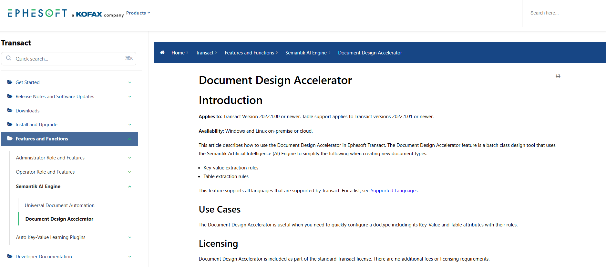

**Project:** Create a detailed feature guide to introduce and document a new plugin.

**Context:** Ephesoft developed a collection of new features that fundamentally altered the way administrators use the product. One of those features was a plugin called Document Design Accelerator. This plugin simplified the batch class creation process by using AI to extract rules automatically. 

Transact’s documentation is formal. The primary audiences are developers and system administrators.

**Link:** [Document Design Accelerator (PDF)](https://drive.google.com/file/d/1GelYSA78gRoIwSMyEn0cLX4L-cis2Dn0/view?usp=sharing)
