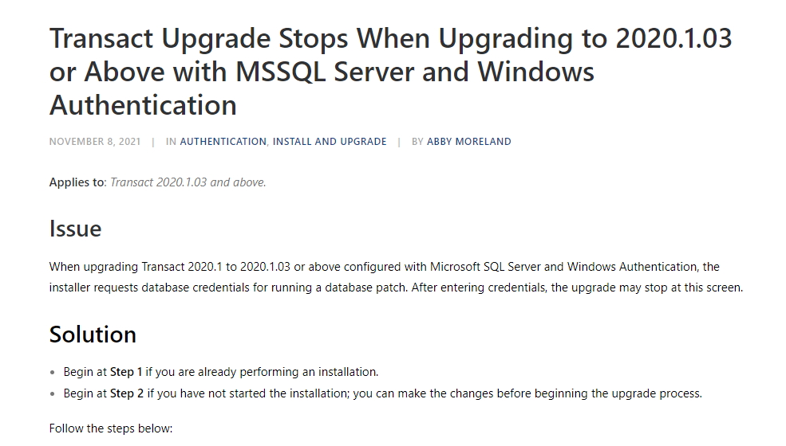

**Project:** Write a knowledge base article on how to resolve an issue that occurs when upgrading Transact with a specific setup.

**Context:** At Ephesoft, requests for knowledge base articles came from the Customer Support engineers based on customer tickets. This particular issue occurred frequently enough that the Support team wanted to document it until the bug was fully resolved. 

A limitation is that I was unable to grab my own screenshots due to not having access to a specific test environment. I had to use the screenshots the developer provided me.

**Achievements:** When I received this request, there wasn’t much information on what type of setup caused the issue. I studied the customer ticket and worked closely with an engineer to understand how to document this issue so affected users could find the article on their own, instead of waiting several days for Support to respond.

**Link:** [Transact Upgrade Stops When Upgrading to 2020.1.03 or Above (PDF)](https://drive.google.com/file/d/1pKiV4660qe2C7si0VrdC7sx0PQju458M/view?usp=drive_link)