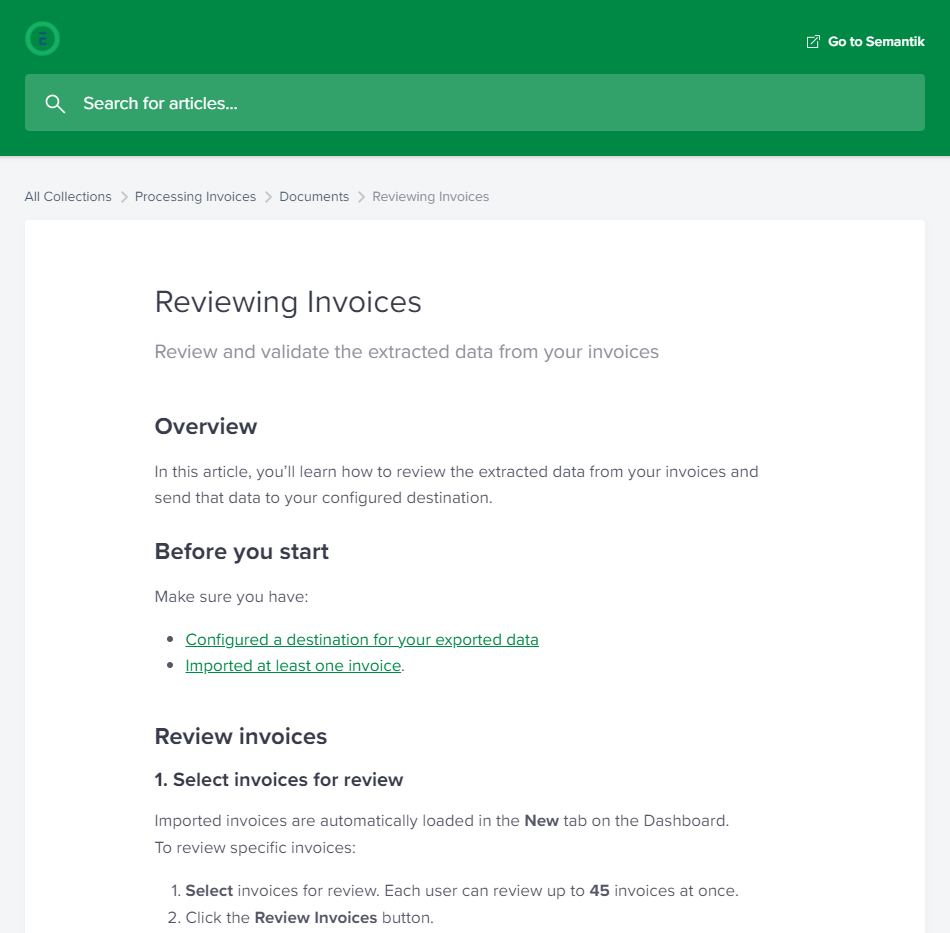

**Project:** Document how to review the data Ephesoft's product Semantik Invoice extracted from a user’s unique invoices.

**Context:** At the time I was brought in, Semantik was a new product with sparse documentation.  I collaborated with the product owner to determine which features were used the most, then used that information to prioritize what to document.

Semantik Invoice’s documentation is conversational and casual. The primary audiences are end users and administrators.

**Achievements:** Researched accounting practices to understand why certain index fields existed and was the first at the company to internally document how those fields were used. Provided UX feedback to the lead UI developer and product owner.

**Link:** [Reviewing Invoices (Google Doc)](https://docs.google.com/document/d/1GSSZJzFmVpVFdEEEMV0i1Qrmqu0M7z1dOLSmhH0BlzU/edit?usp=sharing)