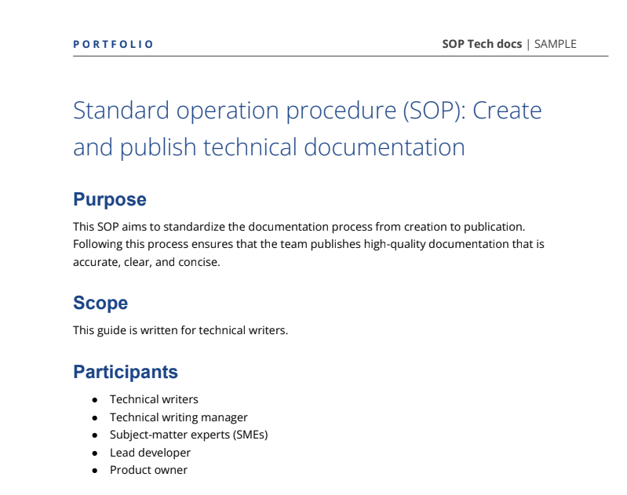

**Project:** Write an SOP to define the process of creating and publishing technical documentation as a technical writer.

**Link:** [SOP: Create and publish technical documentation (PDF)](https://drive.google.com/file/d/1DZMHn-yJeN5y7dAvIdMyhW_W9zsE3Lol/view?usp=sharing)