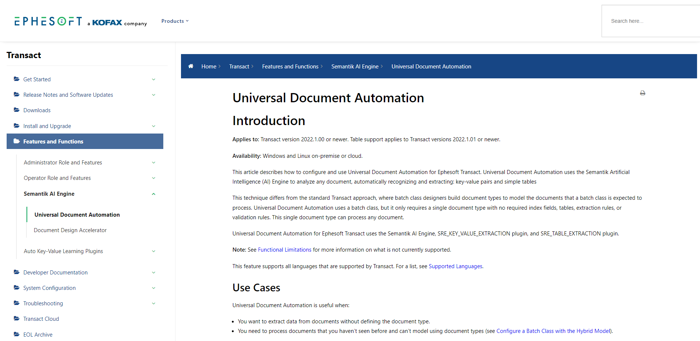

**Project:** Create a detailed feature guide to introduce and document a new plugin.

**Context:** Ephesoft developed a collection of new features that fundamentally altered the way administrators use our product. One of those features was a plugin called Universal Document Automation. This plugin functioned similarly to existing components, but the key difference was that users could get started with little-to-no configuration.

Transact’s documentation is formal. The primary audiences are developers and system administrators.

**Achievements:** Figured out how to use a new plugin while still in the early development stages, including multiple use cases. Condensed the writing cycle to fit the tight deadline.

**Link:** [Universal Document Automation (PDF)](https://drive.google.com/file/d/1ImFy5bOj2NikngQK6U43EnQ0dg2sLGR0/view?usp=sharing)
